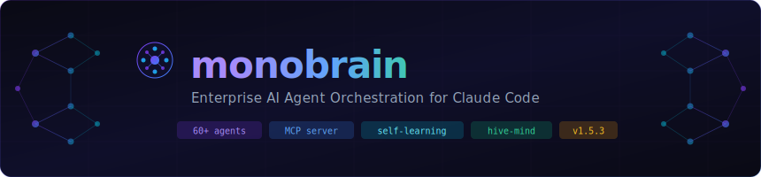
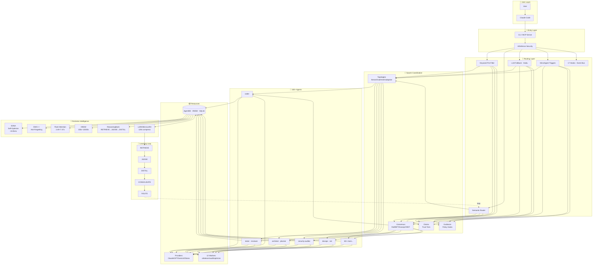

<div align="center">



<br/>

[](https://www.npmjs.com/package/monobrain)
[](https://www.npmjs.com/package/monobrain)
[](https://github.com/monoes/monobrain)
[](https://opensource.org/licenses/MIT)
[](https://nodejs.org)
[](https://www.typescriptlang.org)

_Deploy 60+ specialized agents in coordinated swarms with self-learning capabilities, fault-tolerant consensus, and enterprise-grade security._

</div>

> **Why Monobrain?** Claude Code is powerful — but it thinks alone. Monobrain gives it a brain trust: a coordinated swarm of 100+ specialized agents that share memory, reach consensus, learn from every task, and route work to the right specialist automatically. Built on a WASM-powered intelligence layer, it gets smarter every session.

## How Monobrain Works

```
User → Monobrain (CLI/MCP) → Router → Swarm → Agents → Memory → LLM Providers
                           ↑                          ↓
                           └──── Learning Loop ←──────┘
```

<details>
<summary>📐 <strong>Expanded Architecture</strong> — Full system diagram with RuVector intelligence</summary>



**RuVector Intelligence Components:**

| Component             | Purpose                                                         | Performance                      |
| --------------------- | --------------------------------------------------------------- | -------------------------------- |
| **SONA**              | Self-Optimizing Neural Architecture — learns optimal routing    | <0.05ms adaptation               |
| **EWC++**             | Elastic Weight Consolidation — prevents catastrophic forgetting | Preserves all learned patterns   |
| **Flash Attention**   | Optimized attention computation                                 | 2.49–7.47× speedup               |
| **HNSW**              | Hierarchical Navigable Small World vector search                | 150×–12,500× faster              |
| **ReasoningBank**     | Pattern storage with RETRIEVE→JUDGE→DISTILL pipeline            | Sub-ms recall                    |
| **Hyperbolic**        | Poincaré ball embeddings for hierarchical data                  | Better code relationship mapping |
| **LoRA / MicroLoRA**  | Low-Rank Adaptation weight compression                          | 128× compression ratio           |
| **Int8 Quantization** | Memory-efficient weight storage                                 | ~4× memory reduction             |
| **9 RL Algorithms**   | Q-Learning, SARSA, A2C, PPO, DQN, A3C, TD3, SAC, HER            | Task-specific policy learning    |

</details>

---

## Get Started Fast

**Option 1 — npx (recommended):**

```bash
npx monobrain@latest init --wizard
claude mcp add monobrain -- npx -y monobrain@latest mcp start
npx monobrain@latest daemon start
npx monobrain@latest doctor --fix
```

**Option 2 — Clone from GitHub:**

```bash
git clone https://github.com/nokhodian/monobrain.git
cd monobrain
npm install
node packages/@monobrain/cli/bin/cli.js init --wizard

# Wire up the MCP server in Claude Code
claude mcp add monobrain -- node "$PWD/packages/@monobrain/cli/bin/cli.js" mcp start
```

> **New to Monobrain?** You don't need to learn 170+ MCP tools or 41 CLI commands up front. After running `init`, just use Claude Code normally — the hooks system automatically routes tasks to the right agents, learns from successful patterns, and coordinates multi-agent work in the background.

---

## Key Capabilities

🤖 **100+ Specialized Agents** — Ready-to-use AI agents for every engineering domain: coding, review, testing, security, DevOps, mobile, ML, blockchain, SRE, and more. Each optimized for its specific role.

🐝 **Coordinated Agent Swarms** — Agents organize into teams using hierarchical (queen/workers) or mesh (peer-to-peer) topologies. They share context, divide work, and reach consensus — even when agents fail.

🧠 **Learns From Every Session** — Successful patterns are stored in HNSW-indexed vector memory and reused. Similar tasks route to the best-performing agents automatically. Gets smarter over time without retraining.

⚡ **3-Tier Cost Routing** — Simple transforms run in WASM at <1ms and $0. Medium tasks use Haiku. Complex reasoning uses Sonnet/Opus. Smart routing cuts API costs by 30–50%.

🔌 **Deep Claude Code Integration** — 170+ MCP tools expose the full platform directly inside Claude Code sessions. The hooks system fires on every file edit, command, task start/end, and session event.

🔒 **Production-Grade Security** — CVE-hardened AIDefence layer blocks prompt injection, path traversal, command injection, and credential leakage. Per-agent WASM/Docker sandboxing with cryptographic audit proofs.

🧩 **Extensible Plugin System** — Add custom capabilities with the plugin SDK. Distribute via the IPFS-based decentralized marketplace. 20 plugins available today across core, integration, optimization, and domain categories.

🏛️ **Runtime Governance** — `@monobrain/guidance` compiles your `CLAUDE.md` into enforced policy gates: destructive-op blocking, tool allowlists, diff size limits, secret detection, trust tiers, and HMAC-chained proof envelopes.

---

## Claude Code: With vs Without Monobrain

| Capability              | Claude Code Alone               | Claude Code + Monobrain                                              |
| ----------------------- | ------------------------------- | -------------------------------------------------------------------- |
| **Agent Collaboration** | One agent, isolated context     | Swarms with shared memory and consensus                              |
| **Hive Mind**           | ⛔ Not available                | Queen-led hierarchical swarms with 3+ queen types                    |
| **Consensus**           | ⛔ No multi-agent decisions     | Byzantine fault-tolerant (f < n/3), Raft, Gossip, CRDT               |
| **Memory**              | Session-only, ephemeral         | HNSW vector memory + knowledge graph, persistent cross-session       |
| **Self-Learning**       | Static, starts fresh every time | SONA self-optimization, EWC++ anti-forgetting, pattern reuse         |
| **Task Routing**        | Manual agent selection          | Intelligent 3-layer routing (keyword → semantic → LLM), 89% accuracy |
| **Simple Transforms**   | Full LLM call every time        | Agent Booster (WASM): <1ms, $0 cost                                  |
| **Background Work**     | Nothing runs automatically      | 12 workers auto-dispatch on hooks events                             |
| **LLM Providers**       | Anthropic only                  | Claude, GPT, Gemini, Cohere, Ollama with failover and cost routing   |
| **Security**            | Standard Claude sandboxing      | CVE-hardened, WASM/Docker sandbox per agent, cryptographic proofs    |
| **Governance**          | CLAUDE.md is advisory           | Runtime-enforced policy gates with HMAC audit trail                  |
| **Cost**                | Full LLM cost every task        | 30–50% reduction via WASM, caching, smart routing                    |

---

## Architecture Deep Dives

<details>
<summary>🧭 <strong>Intelligent Task Routing</strong> — 3-layer pipeline that routes every request</summary>

Every request passes through a 3-layer pipeline before any agent sees it:

```
Request
  │
  ├─► [Layer 1] Keyword pre-filter     → instant match, zero LLM cost
  │
  ├─► [Layer 2] Semantic routing       → embedding similarity vs. agent catalog
  │
  └─► [Layer 3] LLM fallback (Haiku)  → Haiku-powered classification for ambiguous tasks
```

Once classified, the task hits the **3-tier cost model**:

| Tier  | Handler              | Latency | Cost          | Used for                                          |
| ----- | -------------------- | ------- | ------------- | ------------------------------------------------- |
| **1** | Agent Booster (WASM) | <1ms    | **$0**        | Simple transforms (var→const, add types, logging) |
| **2** | Haiku                | ~500ms  | ~$0.0002      | Moderate tasks, summaries, Q&A                    |
| **3** | Sonnet / Opus        | 2–5s    | $0.003–$0.015 | Architecture, security, complex reasoning         |

**Hook signals** — what the system emits to guide routing:

```bash
# Agent Booster can handle it — skip LLM entirely
[AGENT_BOOSTER_AVAILABLE] Intent: var-to-const
→ Use Edit tool directly, <1ms, $0

# Model recommendation for Task tool
[TASK_MODEL_RECOMMENDATION] Use model="haiku" (complexity=22)
→ Pass model="haiku" to Task tool for cost savings
```

**Microagent trigger scanner** — 10 specialist agents with keyword frontmatter triggers:

| Domain   | Trigger keywords                        | Agent                |
| -------- | --------------------------------------- | -------------------- |
| Security | `auth`, `injection`, `CVE`, `secret`    | `security-architect` |
| DevOps   | `deploy`, `CI/CD`, `pipeline`, `k8s`    | `devops-automator`   |
| Database | `query`, `schema`, `migration`, `index` | `database-optimizer` |
| Frontend | `React`, `CSS`, `component`, `SSR`      | `frontend-dev`       |
| Solidity | `contract`, `ERC`, `Solidity`, `DeFi`   | `solidity-engineer`  |

</details>

<details>
<summary>🐝 <strong>Swarm Coordination</strong> — How agents organize and reach consensus</summary>

Agents organize into swarms with configurable topologies and consensus algorithms:

| Topology         | Best for                             | Consensus           |
| ---------------- | ------------------------------------ | ------------------- |
| **Hierarchical** | Coding tasks, feature work (default) | Raft (leader-based) |
| **Mesh**         | Distributed exploration, research    | Gossip / CRDT       |
| **Adaptive**     | Auto-switches based on load          | Byzantine (BFT)     |

**Consensus algorithms:**

| Algorithm           | Fault tolerance          | Use case                           |
| ------------------- | ------------------------ | ---------------------------------- |
| **Raft**            | f < n/2                  | Authoritative state, coding swarms |
| **Byzantine (BFT)** | f < n/3                  | Untrusted environments             |
| **Gossip**          | Eventual consistency     | Large swarms (100+ agents)         |
| **CRDT**            | No coordination overhead | Conflict-free concurrent writes    |

**Anti-drift swarm configuration** (recommended for all coding tasks):

```bash
npx monobrain@latest swarm init \
  --topology hierarchical \
  --max-agents 8 \
  --strategy specialized \
  --consensus raft
```

| Setting          | Why it prevents drift                               |
| ---------------- | --------------------------------------------------- |
| `hierarchical`   | Coordinator validates every output against the goal |
| `max-agents 6–8` | Smaller team = less coordination overhead           |
| `specialized`    | Clear roles, no task overlap                        |
| `raft`           | Single leader maintains authoritative state         |

**Task → agent routing:**

| Task           | Agents                                              |
| -------------- | --------------------------------------------------- |
| Bug fix        | coordinator · researcher · coder · tester           |
| New feature    | coordinator · architect · coder · tester · reviewer |
| Refactor       | coordinator · architect · coder · reviewer          |
| Performance    | coordinator · perf-engineer · coder                 |
| Security audit | coordinator · security-architect · auditor          |

</details>

<details>
<summary>🧠 <strong>Self-Learning Intelligence</strong> — How Monobrain gets smarter every session</summary>

Every task feeds the 4-step RETRIEVE-JUDGE-DISTILL-CONSOLIDATE pipeline:

```
RETRIEVE  ──►  JUDGE  ──►  DISTILL  ──►  CONSOLIDATE
   │               │            │               │
HNSW search   success/fail   LoRA extract   EWC++ preserve
150x faster    verdicts       128x compress  anti-forgetting
```

**Memory architecture:**

| Feature               | Details                                                       |
| --------------------- | ------------------------------------------------------------- |
| **Episodic memory**   | Full task histories with timestamps and outcomes              |
| **Entity extraction** | Automatic extraction of code entities into structured records |
| **Procedural memory** | Learned skills from `.monobrain/skills.jsonl`                 |
| **Vector search**     | 384-dim embeddings, sub-ms retrieval via HNSW                 |
| **Knowledge graph**   | PageRank + community detection for structural insights        |
| **Agent isolation**   | Per-agent memory scopes prevent cross-contamination           |
| **Hybrid backend**    | SQLite + AgentDB, zero native binary dependencies             |

**Specialization scorer** — per-agent, per-task-type success/failure tracking with time-decay. Feeds routing quality over time. Persists to `.monobrain/scores.jsonl`.

</details>

<details>
<summary>⚡ <strong>Agent Booster (WASM)</strong> — Skip the LLM for simple code transforms</summary>

Agent Booster uses WebAssembly to handle deterministic code transforms without any LLM call:

| Intent               | Example                        | vs LLM      |
| -------------------- | ------------------------------ | ----------- |
| `var-to-const`       | `var x = 1` → `const x = 1`    | 352× faster |
| `add-types`          | Add TypeScript annotations     | 420× faster |
| `add-error-handling` | Wrap in try/catch              | 380× faster |
| `async-await`        | `.then()` → `async/await`      | 290× faster |
| `add-logging`        | Insert structured debug logs   | 352× faster |
| `remove-console`     | Strip all `console.*` calls    | 352× faster |
| `format-string`      | Modernize to template literals | 400× faster |
| `null-check`         | Add `?.` / `??` operators      | 310× faster |

When hooks emit `[AGENT_BOOSTER_AVAILABLE]`, Claude Code intercepts and uses the Edit tool directly — zero LLM round-trip.

</details>

<details>
<summary>💰 <strong>Token Optimizer</strong> — 30–50% API cost reduction</summary>

Smart caching and routing stack multiplicatively to reduce API costs:

| Optimization                 | Savings    | Mechanism                                   |
| ---------------------------- | ---------- | ------------------------------------------- |
| ReasoningBank retrieval      | –32%       | Fetches relevant patterns, not full context |
| Agent Booster transforms     | –15%       | Simple edits skip LLM entirely              |
| Pattern cache (95% hit rate) | –10%       | Reuses embeddings and routing decisions     |
| Optimal batch size           | –20%       | Groups related operations                   |
| **Combined**                 | **30–50%** | Multiplicative stacking                     |

</details>

<details>
<summary>🏛️ <strong>Governance</strong> — Runtime policy enforcement from CLAUDE.md</summary>

`@monobrain/guidance` compiles `CLAUDE.md` into a 7-phase runtime enforcement pipeline:

```
CLAUDE.md ──► Compile ──► Retrieve ──► Enforce ──► Trust ──► Prove ──► Defend ──► Evolve
```

| Phase       | Enforces                                                            |
| ----------- | ------------------------------------------------------------------- |
| **Enforce** | Destructive ops, tool allowlist, diff size limits, secret detection |
| **Trust**   | Per-agent trust accumulation with privilege tiers                   |
| **Prove**   | HMAC-SHA256 hash-chained audit envelopes                            |
| **Defend**  | Prompt injection, memory poisoning, collusion detection             |
| **Evolve**  | Policy drift detection, auto-update proposals                       |

1,331 tests · 27 subpath exports · WASM security kernel

</details>

---

## Quick Start

### Prerequisites

- **Node.js 20+** (required)
- **Claude Code** — `npm install -g @anthropic-ai/claude-code`

### Installation

**One-line (recommended):**

```bash
curl -fsSL https://cdn.jsdelivr.net/gh/nokhodian/monobrain@main/scripts/install.sh | bash
```

**Via npx:**

```bash
npx monobrain@latest init --wizard
```

**Manual:**

```bash
# Register MCP server with Claude Code
claude mcp add monobrain -- npx -y monobrain@latest mcp start

# Start background worker daemon
npx monobrain@latest daemon start

# Health check
npx monobrain@latest doctor --fix
```

### First Commands

```bash
# Spawn an agent
npx monobrain@latest agent spawn -t coder --name my-coder

# Launch a full swarm
npx monobrain@latest hive-mind spawn "Refactor auth module to use OAuth2"

# Search learned patterns
npx monobrain@latest memory search -q "authentication patterns"
```

---

## ⚡ Slash Commands

> Type these directly in Claude Code. No setup beyond `npx monobrain init`.

---

### 🤖 Agent Intelligence

| Command | What it does |
|---|---|
| **`/specialagent`** | Scores all 60+ agents against your task and picks the best one (or recommends a full swarm config). Prevents wasting a generic `coder` on a job that needs a `Database Optimizer` or `tdd-london-swarm`. |
| **`/use-agent [slug]`** | Instantly activates a non-dev specialist agent — Sales Coach, TikTok Strategist, Legal Compliance Checker, UX Researcher, etc. Without a slug, auto-picks from conversation context. |
| **`/list-agents [category]`** | Lists all available specialist agents, optionally filtered by category (`marketing`, `sales`, `design`, `academic`, `product`, `project-management`, `support`). |

---

### 🌐 Browser & UI Automation

| Command | What it does |
|---|---|
| **`/ui-test <url>`** | Full UI test run: opens the URL, snapshots interactive elements, walks golden-path flows, tests edge cases, reports pass/fail/warn. Powered by `agent-browser`. |
| **`/browse <url>`** | Navigates to a URL and walks through it step by step — narrating what's on screen, proposing actions, and helping you accomplish tasks via the browser. |
| **`/crawl <url>`** | Crawls a website — extracts links, text, structured data, or anything you specify. Great for scraping, auditing, or data extraction tasks. |
| **`/browser`** | Raw agent-browser session: opens an interactive browser automation context with snapshot, click, fill, and screenshot tools. Use when you need fine-grained control. |

---

### 🏛️ SPARC Methodology

| Command | What it does |
|---|---|
| **`/sparc`** | Runs the full SPARC orchestrator — breaks down your objective, delegates to the right modes, and coordinates the full development lifecycle. |
| **`/sparc spec-pseudocode`** | Captures requirements, edge cases, and constraints, then translates them into structured pseudocode ready for implementation. |
| **`/sparc code`** | Auto-coder mode — writes clean, efficient, modular code from pseudocode or a spec. |
| **`/sparc debug`** | Debugger mode — traces runtime bugs, logic errors, and integration failures systematically. |
| **`/sparc security-review`** | Security reviewer — static and dynamic audit, flags secrets, poor module boundaries, and injection risks. |
| **`/sparc devops`** | DevOps mode — CI/CD, Docker, deployment automation. |
| **`/sparc docs-writer`** | Writes clear, modular Markdown documentation: READMEs, API references, usage guides. |
| **`/sparc refinement-optimization-mode`** | Refactors, modularizes, and improves system performance. Enforces file size limits and dependency hygiene. |
| **`/sparc integration`** | System integrator — merges outputs of all modes into a working, tested, production-ready system. |

---

### 🐝 Swarm & Memory

| Command | What it does |
|---|---|
| **`/monobrain-swarm`** | Coordinates a multi-agent swarm for complex tasks — spawns agents, distributes work, waits for results, synthesizes output. |
| **`/monobrain-memory`** | Interacts with the AgentDB memory system — store, search, retrieve, and inspect patterns across sessions. |
| **`/monobrain-help`** | Shows all Monobrain CLI commands and usage reference inline. |

---

> **Pro tip — automatic activation:** You don't need to type slash commands for most flows. The `UserPromptSubmit` hook reads every prompt and automatically suggests the right slash command (or activates it) based on what you wrote. `/specialagent` activates when you ask "which agent", `/ui-test` activates when you say "test the UI", `/browse` activates when you say "go to the website", etc.

---

## Agents

100+ specialized agents across every engineering domain:

<details>
<summary>🔧 <strong>Core Development</strong></summary>

| Agent        | Specialization                                       |
| ------------ | ---------------------------------------------------- |
| `coder`      | Clean, efficient implementation across any language  |
| `reviewer`   | Code review — correctness, security, maintainability |
| `tester`     | TDD, integration, E2E, coverage analysis             |
| `planner`    | Task decomposition, sprint planning, roadmap         |
| `researcher` | Deep research, information gathering                 |
| `architect`  | System design, DDD, architectural patterns           |
| `analyst`    | Code quality analysis and improvement                |

</details>

<details>
<summary>🔒 <strong>Security</strong></summary>

| Agent                | Specialization                                           |
| -------------------- | -------------------------------------------------------- |
| `security-architect` | Threat modeling, secure design, vulnerability assessment |
| `security-auditor`   | Smart contract audits, CVE analysis                      |
| `security-engineer`  | Application security, OWASP, secure code review          |
| `threat-detection`   | SIEM rules, MITRE ATT&CK, detection engineering          |
| `compliance-auditor` | SOC 2, ISO 27001, HIPAA, PCI-DSS                         |

</details>

<details>
<summary>🐝 <strong>Swarm & Consensus</strong></summary>

| Agent                      | Specialization                                            |
| -------------------------- | --------------------------------------------------------- |
| `hierarchical-coordinator` | Queen-led coordination with specialized worker delegation |
| `mesh-coordinator`         | P2P mesh, distributed decision-making, fault tolerance    |
| `adaptive-coordinator`     | Dynamic topology switching, self-organizing               |
| `byzantine-coordinator`    | BFT consensus, malicious actor detection                  |
| `raft-manager`             | Raft protocol, leader election, log replication           |
| `gossip-coordinator`       | Gossip-based eventual consistency                         |
| `crdt-synchronizer`        | Conflict-free replication                                 |
| `consensus-coordinator`    | Sublinear solvers, fast agreement                         |

</details>

<details>
<summary>🚀 <strong>DevOps & Infrastructure</strong></summary>

| Agent                | Specialization                                      |
| -------------------- | --------------------------------------------------- |
| `devops-automator`   | CI/CD pipelines, infrastructure automation          |
| `cicd-engineer`      | GitHub Actions, pipeline creation                   |
| `sre`                | SLOs, error budgets, chaos engineering              |
| `incident-response`  | Production incident management, post-mortems        |
| `database-optimizer` | Schema design, query optimization, PostgreSQL/MySQL |
| `data-engineer`      | Data pipelines, lakehouse, dbt, Spark, streaming    |

</details>

<details>
<summary>🌐 <strong>Frontend, Mobile & Specialized</strong></summary>

| Agent               | Specialization                                  |
| ------------------- | ----------------------------------------------- |
| `frontend-dev`      | React/Vue/Angular, UI, performance optimization |
| `mobile-dev`        | React Native iOS/Android, cross-platform        |
| `accessibility`     | WCAG, screen readers, inclusive design          |
| `solidity-engineer` | EVM smart contracts, gas optimization, DeFi, L2 |
| `ml-engineer`       | ML model development, training, deployment      |
| `embedded-firmware` | ESP32, STM32, FreeRTOS, Zephyr, bare-metal      |
| `backend-architect` | Scalable systems, microservices, API design     |
| `technical-writer`  | Developer docs, API references, tutorials       |

</details>

<details>
<summary>🔀 <strong>GitHub Workflow Automation</strong></summary>

| Agent                 | Specialization                                      |
| --------------------- | --------------------------------------------------- |
| `pr-manager`          | PR lifecycle, review coordination, merge management |
| `code-review-swarm`   | Parallel multi-agent code review                    |
| `release-manager`     | Automated release coordination, changelog           |
| `repo-architect`      | Repository structure, multi-repo management         |
| `issue-tracker`       | Issue management, project coordination              |
| `workflow-automation` | GitHub Actions creation and optimization            |

</details>

<details>
<summary>🔬 <strong>SPARC Methodology</strong></summary>

| Agent           | Specialization                          |
| --------------- | --------------------------------------- |
| `sparc-coord`   | SPARC orchestrator across all 5 phases  |
| `specification` | Requirements analysis and decomposition |
| `pseudocode`    | Algorithm design, logic planning        |
| `architecture`  | System design from spec                 |
| `refinement`    | Iterative improvement                   |
| `sparc-coder`   | TDD-driven implementation from specs    |

View all: `npx monobrain@latest agent list`

</details>

---

## Live Statusline

Monobrain adds a real-time six-row dashboard to Claude Code:

```
▊ Monobrain v1.0.0  ○ IDLE  nokhodian  │  ⎇ main  +1  ~9921 mod  ↑5  │  🤖 Sonnet 4.6
──────────────────────────────────────────────────────────────────────────────────────
💡  INTEL    ▱▱▱▱▱▱ 3%   │   📚 190 chunks   │   76 patterns
──────────────────────────────────────────────────────────────────────────────────────
🐝  SWARM    0/15 agents   ⚡ 14/14 hooks   │   🎯 3 triggers · 24 agents   │   → ROUTED  👤 Coder  81%
──────────────────────────────────────────────────────────────────────────────────────
🧩  ARCH     82/82 ADRs   │   DDD ▰▰▱▱▱ 40%   │   🛡️ ✖ NONE   │   CVE not scanned
──────────────────────────────────────────────────────────────────────────────────────
🗄️  MEMORY   0 vectors   │   2.0 MB   │   🧪 66 test files   │   MCP 1/1  DB ✔
──────────────────────────────────────────────────────────────────────────────────────
📋  CONTEXT  📄 SI 80% budget (1201/1500 chars)   │   🏗 ▰▰▱▱▱ 2/5 domains   │   💾 47 MB RAM
```

| Row         | Shows                                                               |
| ----------- | ------------------------------------------------------------------- |
| **Header**  | Version, session state, git user, branch, uncommitted changes       |
| **INTEL**   | Intelligence score, knowledge chunks indexed, learned patterns      |
| **SWARM**   | Active agents, hook count, microagent triggers, last routing result |
| **ARCH**    | ADR compliance, DDD domain coverage, security gates, CVE status     |
| **MEMORY**  | Vector count, DB size, test file count, MCP/DB health               |
| **CONTEXT** | Shared instructions budget, domain coverage, RAM usage              |

Toggle compact ↔ full: `/ts` — Full reference: [tagline.md](tagline.md)

---

## Packages

todo: write about packages of this app

## Plugins

todo: write about plugins of this app
20 plugins via the IPFS-distributed registry:

```bash
npx monobrain@latest plugins list
npx monobrain@latest plugins install @monobrain/plugin-name
npx monobrain@latest plugins create my-plugin
```

## Contributing

```bash
git clone https://github.com/nokhodian/monobrain.git
cd monobrain/packages
pnpm install
pnpm test
```

## Support

|               |                                                                                        |
| ------------- | -------------------------------------------------------------------------------------- |
| Documentation | [github.com/nokhodian/monobrain](https://github.com/nokhodian/monobrain)               |
| Issues        | [github.com/nokhodian/monobrain/issues](https://github.com/nokhodian/monobrain/issues) |
| Enterprise    | [monoes.me](monoes.me)                                                                 |

---

MIT — [nokhodian](https://github.com/nokhodian)

---

## Acknowledgements

Monobrain builds on ideas, patterns, and research from the following projects:

| Repository                                                                      | What we took                                                                                                                                     |
| ------------------------------------------------------------------------------- | ------------------------------------------------------------------------------------------------------------------------------------------------ |
| [ruvnet/ruflo](https://github.com/ruvnet/ruflo)                                 | Original skeleton — swarm coordination, hooks system, and SPARC methodology                                                                      |
| [msitarzewski/agency-agents](https://github.com/msitarzewski/agency-agents)     | Agent architecture patterns and multi-agent md files                                                                                             |
| [microsoft/autogen](https://github.com/microsoft/autogen)                       | Human oversight interrupt gates, AutoBuild ephemeral agents, procedural skill learning from executions, and tool-retry patterns                  |
| [crewAIInc/crewAI](https://github.com/crewAIInc/crewAI)                         | Multi-tier memory (short/long/entity/contextual), role/goal/backstory agent registry, task context chaining, and output schema patterns          |
| [langchain-ai/langgraph](https://github.com/langchain-ai/langgraph)             | Graph checkpointing + resume, `StateGraph` workflow DSL (fan-out/fan-in, conditional, loops), and entity extraction from conversation state      |
| [All-Hands-AI/OpenHands](https://github.com/All-Hands-AI/OpenHands)             | Per-agent Docker/WASM sandboxing, semantic versioned agent registry (AgentHub), and EventStream session replay                                   |
| [agno-agi/agno](https://github.com/agno-agi/agno)                               | `AgentMemory` knowledge base architecture and team-level agent coordination class                                                                |
| [huggingface/smolagents](https://github.com/huggingface/smolagents)             | Explicit planning step before execution and `ManagedAgent` delegation wrapper                                                                    |
| [pydantic/pydantic-ai](https://github.com/pydantic/pydantic-ai)                 | Typed `Agent[Deps, Result]` I/O schemas, auto-retry on validation failure, `TestModel` for deterministic CI, and dynamic system prompt functions |
| [BAAI/AgentSwarm (Agency Swarm)](https://github.com/VRSEN/agency-swarm)         | Declared directed communication flows between agents and shared instruction propagation                                                          |
| [BerriAI/atomic-agents](https://github.com/KRunchPL/atomic-agents)              | `BaseIOSchema` typed agent contracts and `SystemPromptContextProvider` composition                                                               |
| [stanfordnlp/dspy](https://github.com/stanfordnlp/dspy)                         | `BootstrapFewShot` + MIPRO automatic prompt optimization pipeline                                                                                |
| [aurelio-labs/semantic-router](https://github.com/aurelio-labs/semantic-router) | Utterance-based `RouteLayer` replacing static routing codes, dynamic routes, and hybrid routing mode                                             |
| [langfuse/langfuse](https://github.com/langfuse/langfuse)                       | Unified trace/span/generation observability hierarchy, per-agent cost attribution, latency views, and prompt version management                  |
| [karpathy/autoresearch](https://github.com/karpathy/autoresearch)               | Experiment loop protocol (BASELINE/KEEP/DISCARD `results.tsv`), fixed time-budget per run, and Best-Fit Decreasing bin packing for API chunking — wired into `@monoes/graph` pipeline |
| [safishamsi/graphify](https://github.com/safishamsi/graphify)                   | Knowledge graph construction approach, AST-based node/edge extraction, community detection with Louvain, and `GRAPH_REPORT.md` report format — foundation for `@monoes/graph`          |
| [google/gvisor](https://gvisor.dev) ([paper](https://dl.acm.org/doi/10.1145/3317550.3321422)) | gVisor `runsc` OCI-compatible runtime — reduces Docker container syscall surface from 350+ to ~50 interceptions; wired into `SandboxConfig.use_gvisor` and `buildDockerArgs()` |
| [Indirect Injection research](https://arxiv.org/abs/2302.12173) ([follow-up](https://arxiv.org/abs/2310.12815)) | Prompt injection via external tool content — `validateExternalContent()` in `@monobrain/security` applies pattern + optional aidefence semantic scan to all externally-sourced content |
| [FOREVER Forgetting Curve](https://arxiv.org/html/2601.03938v1)                 | Exponential importance-weighted forgetting curve (`importanceScore × e^(−λt)`) replacing linear decay — implemented in `LearningBridge.decayConfidences()` and `MemoryEntry.importanceScore` |
| [Awesome RLVR](https://github.com/opendilab/awesome-RLVR)                       | Reinforcement Learning with Verifiable Rewards — `hooksModelOutcome` now accepts `verifier_type` (tsc/vitest/eslint/llm_judge) and `exit_code` to derive grounded binary reward signals |
| [ERL — Experiential Reflective Learning](https://arxiv.org/abs/2603.24639)      | Structured `{condition, action, confidence}` heuristics extracted at `hooks_post-task` and injected as ranked hints into `hooks_pre-task` suggestions via the `heuristics` memory namespace |
| [A-MEM — Agentic Memory](https://arxiv.org/abs/2502.12110)                      | Zettelkasten-style automatic note linking — after every `bridgeStoreEntry`, top-3 HNSW neighbors above 0.7 similarity receive a `similar` causal edge via `bridgeRecordCausalEdge` |
| [DSPy](https://dspy.ai)                                                         | Bayesian exploration option (`bayesian: true`) added to `PromptOptimizer.optimize()` — shuffles trace scores with U(0,0.1) noise before `selectExamples` to escape local optima |
| [Collaborative Memory Promotion](https://arxiv.org/abs/2505.18279)              | Auto-promote memory `access_level` from `private` → `team` when 3+ distinct agents read an entry within 24 h — implemented via `agent_reads` table in `SQLiteBackend` and `checkAndPromoteEntry()` |
| [Zep / Graphiti — Bi-Temporal Knowledge Graph](https://arxiv.org/abs/2501.13956) ([repo](https://github.com/getzep/graphiti)) | Separates event time T from ingestion time T' — `MemoryEntry.eventAt` nullable field + `event_at` SQLite column for temporal filtering without index rebuilds; 94.8% on Deep Memory Retrieval at 90% lower latency than MemGPT |
| [HippoRAG 2 — PPR Graph Retrieval](https://arxiv.org/abs/2405.14831)            | Personalized PageRank over the memory reference graph — `MemoryGraph.pprRerank()` expands HNSW candidates one hop via `MemoryEntry.references`, boosting associative recall by up to 20% on multi-hop QA |
| [RAPTOR — Recursive Abstractive Tree Indexing](https://arxiv.org/abs/2401.18059) | Cluster episodic entries → summarize each cluster → store as `contextual`-tier entry — implemented in the `consolidate` background worker (`runConsolidateWorker`), creating RAPTOR's tree within existing stores |
| [Multi-Agent Reflexion (MAR)](https://arxiv.org/html/2512.20845)                | Heterogeneous Diagnoser → Critic×2 → Aggregator reflection loop — `hooks_post-task` now returns `marReflection` when a task fails, specifying the four agent roles and spawn order |
| [TextGrad — Automatic Differentiation via Text](https://arxiv.org/abs/2406.07496) ([Nature](https://www.nature.com)) | LLM textual gradients flow backward through the pipeline — on `hooks_post-task` failure a `textual_gradient` critique is stored to the `gradients` memory namespace for next-prompt injection; +20% on LeetCode-Hard |
| [CP-WBFT — Confidence-Probe Weighted BFT](https://arxiv.org/abs/2511.10400)     | Confidence-weighted voting replaces one-node-one-vote — `weightedTally()` in `consensus/vote-signer.ts` scales each agent's vote by its confidence score, tolerating 85.7% fault rate (AAAI 2026) |
| [GraphRAG + Practical GraphRAG](https://arxiv.org/abs/2404.16130) ([Practical](https://arxiv.org/abs/2507.03226)) | Community-level global query answering — `MemoryGraph.getCommunitySummaries()` returns top-k community descriptors (nodeCount, avgPageRank) for prepending to semantic search results; enables thematic reasoning over the entire knowledge base |
| [MemPalace](https://github.com/nokhodian/mempalace) | Spatially-organized verbatim memory with Wing→Room→Hall hierarchy, Okapi BM25 + closet-topic hybrid retrieval, score-based L1 promotion, and temporal knowledge graph — implemented in `.claude/helpers/memory-palace.cjs`; injects L0 identity + L1 essential story on every session start via `SessionStart` hook; achieves 96.6% LongMemEval recall without summarization |
